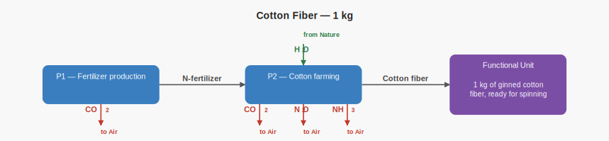
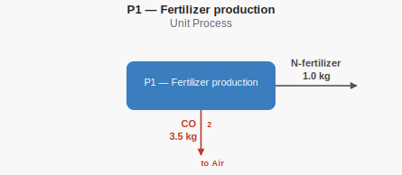
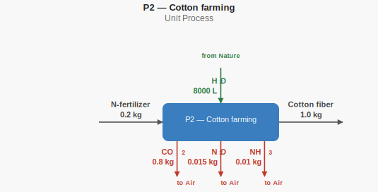
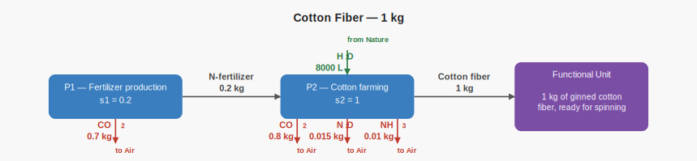

# Cotton fiber hand calculations

This case represents the production of 1 kg of cotton fiber. These calculations
are the independent ground truth recorded in `expected.json` and checked against
Brightway.

## Supply-chain structure



## Unit-process Diagrams (unscaled)

### P1 — Fertilizer production



### P2 — Cotton farming



## Scaled supply-chain diagram



## Process scaling

Cotton farming produces 1 kg of cotton fiber and therefore runs once:

```text
s_cotton = s_2 = 1.0
```

Cotton farming consumes 0.2 kg of fertilizer per kg of cotton fiber:

```text
s_fertilizer = s_1 = s_2 × 0.2 = 0.2
```

## Inventory totals

```text
CO2   = (0.2 × 3.5) + (1.0 × 0.8) = 1.5 kg
N2O   = 1.0 × 0.015                 = 0.015 kg
NH3   = 1.0 × 0.010                 = 0.010 kg
Water = 1.0 × 8000                  = 8000 L
```

## LCIA results

The characterization factors match the TRACI v2.1 factors used by the
corresponding LCA MCP teaching case.

```text
GWP  = (1.5 × 1) + (0.015 × 298) = 5.97 kg CO2-eq
EP   = 0.010 × 0.1186            = 0.001186 kg N-eq
AP   = 0.010 × 1.88              = 0.0188 kg SO2-eq
PMFP = 0.010 × (1 / 15)          = 0.0006666667 kg PM2.5-eq
```
