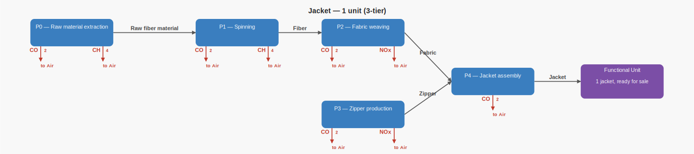
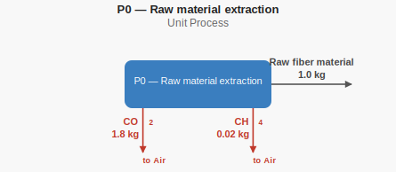
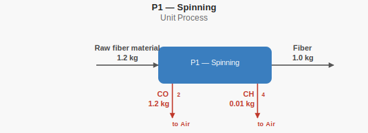
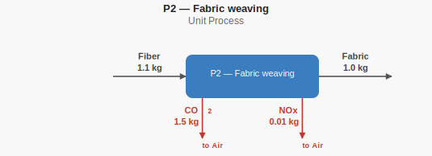
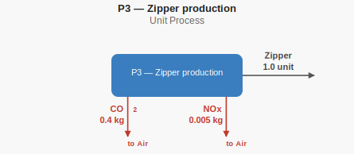
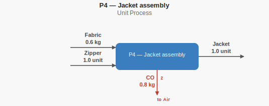
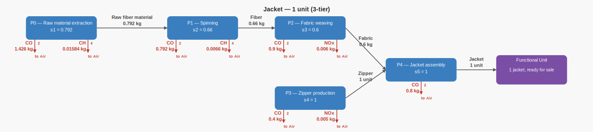

# Jacket hand calculations

This case represents the production of one jacket. These calculations are the
independent ground truth recorded in `expected.json` and checked against
Brightway.

## Supply-chain structure



This image shows the product graph with the flow types but without yet the
actual flow amounts. Blue boxes are unit processes, gray arrows carry products
or intermediate materials between them, and the purple box is the functional
unit. Red arrows are emissions to the environment.

## Unit-process Diagrams (unscaled)

Each diagram isolates one unit process. It shows its product and intermediate
flows, plus its emissions to the environment in red. This is the way a unit
process might appear in the database: its numbers are the exchanges for one
reference run of that process. Multiply each exchange by the matching scaling
factor in the scaled diagram to obtain its contribution to the functional-unit
inventory.

### P0 — Raw material extraction



Producing 1.0 kg of raw fiber material emits 1.8 kg of CO2 and 0.02 kg of CH4
to air.

### P1 — Spinning



Producing 1.0 kg of fiber requires 1.2 kg of raw fiber material and emits
1.2 kg of CO2 and 0.01 kg of CH4 to air.

### P2 — Fabric weaving



Producing 1.0 kg of fabric requires 1.1 kg of fiber and emits 1.5 kg of CO2
and 0.01 kg of NOx to air.

### P3 — Zipper production



Producing 1 zipper emits 0.4 kg of CO2 and 0.005 kg of NOx to air.

### P4 — Jacket assembly



Producing 1 jacket requires 0.6 kg of fabric and 1 zipper, and emits 0.8 kg
of CO2 to air.

## Scaled supply-chain diagram



Each amount shown here comes from a calculation of exactly how much flows
through the product graph to create one functional unit. These amounts can be
thought of as the results of a calculation that starts at the functional unit
and works backward through the product graph. The resulting process scaling
factors (`s_0`, `s_1`, and so on) are used in the inventory and LCIA
calculations below.

## Process scaling

Jacket assembly and zipper production each run once. Jacket assembly needs
0.6 kg of fabric, which in turn needs 1.1 kg of fiber per kg of fabric; spinning
needs 1.2 kg of raw fiber material per kg of fiber.

```text
s_jacket = s_4 = 1.0
s_zipper = s_3 = 1.0
s_fabric = s_2 = s_4 × 0.6       = 0.6
s_fiber  = s_1 = s_2 × 1.1       = 0.66
s_raw    = s_0 = s_1 × 1.2       = 0.792
```

## Inventory totals

```text
CO2 = (0.792 × 1.8) + (0.66 × 1.2) + (0.6 × 1.5) + (1.0 × 0.4) + (1.0 × 0.8)
    = 4.3176 kg
CH4 = (0.792 × 0.02) + (0.66 × 0.01)
    = 0.02244 kg
NOx = (0.6 × 0.01) + (1.0 × 0.005)
    = 0.011 kg
```

## LCIA results

The characterization factors match the TRACI v2.1 factors used by the
corresponding LCA MCP teaching case.

```text
GWP  = (4.3176 × 1) + (0.02244 × 25) = 4.8786 kg CO2-eq
AP   = 0.011 × 0.7                    = 0.0077 kg SO2-eq
EP   = 0.011 × 0.04429                = 0.00048719 kg N-eq
MIR  = (0.02244 × 0.01437948717948718) + (0.011 × 24.79358974358974)
     = 0.27305216287179485 kg O3-eq
PMFP = 0.011 × 0.007222222222222222    = 0.00007944444444444444 kg PM2.5-eq
```
