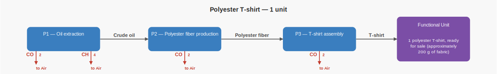
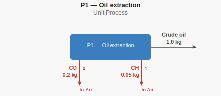
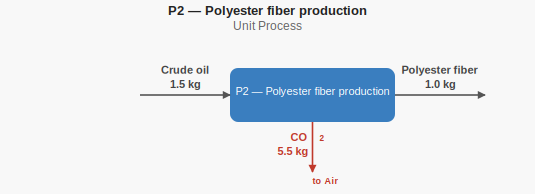
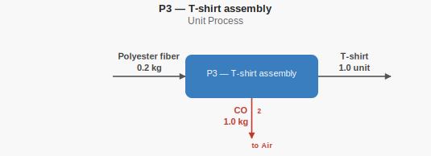
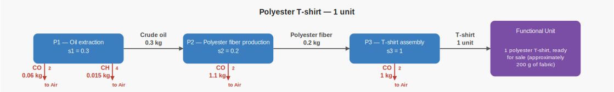

# Polyester T-shirt hand calculations

This case represents the production of one polyester T-shirt. These calculations
are the independent ground truth recorded in `expected.json` and checked against
Brightway.

## Supply-chain structure



This image shows the product graph with the flow types but without yet the
actual flow amounts. Blue boxes are unit processes, gray arrows carry products
or intermediate materials between them, and the purple box is the functional
unit. Green arrows are extractions from nature; red arrows are emissions to the
environment.

## Unit-process Diagrams (unscaled)

Each diagram isolates one unit process. It shows its product and intermediate
flows, plus any elementary flows crossing the system boundary: extractions from
nature in green and emissions to the environment in red.

This is the way a unit process might appear in the database: its numbers are
the exchanges for one reference run of that process. They must be adjusted for
how much of the process actually flows through the product graph. Multiply each
exchange by the matching scaling factor in the scaled diagram to obtain its
contribution to the functional-unit inventory.

### P1 — Oil extraction



Producing 1.0 kg of crude oil emits 0.2 kg of CO2 and 0.05 kg of CH4 to air.

### P2 — Polyester fiber production



Producing 1.0 kg of polyester fiber requires 1.5 kg of crude oil and emits
5.5 kg of CO2 to air.

### P3 — T-shirt assembly



Producing 1 T-shirt requires 0.2 kg of polyester fiber and emits 1.0 kg of
CO2 to air.

## Scaled supply-chain diagram



Each amount shown here comes from a calculation of exactly how much flows
through the product graph to create one functional unit. These amounts can be
thought of as the results of a calculation that starts at the functional unit
and works backward through the product graph. The resulting process scaling
factors (`s_1`, `s_2`, and so on) are used in the inventory and LCIA
calculations below.

## Process scaling

T-shirt assembly runs once and consumes 0.2 kg of polyester fiber. Producing
that fiber consumes 1.5 kg of crude oil per kg of fiber.

```text
s_tshirt = s_3 = 1.0
s_fiber  = s_2 = s_3 × 0.2       = 0.2
s_oil    = s_1 = s_2 × 1.5       = 0.3
```

Polyester fiber production requires 1.5 kg of crude oil per kg of fiber. Since
the functional unit requires only 0.2 kg of fiber, it requires
`0.2 × 1.5 = 0.3 kg` of crude oil.

## Inventory totals

```text
CO2 = (0.3 × 0.2) + (0.2 × 5.5) + (1.0 × 1.0) = 2.16 kg
CH4 = 0.3 × 0.05                                  = 0.015 kg
```

## LCIA results

The characterization factors match the TRACI v2.1 factors used by the
corresponding LCA MCP teaching case.

```text
GWP = (2.16 × 1) + (0.015 × 25)       = 2.535 kg CO2-eq
MIR = 0.015 × 0.014379488             = 0.00021569232 kg O3-eq
```
