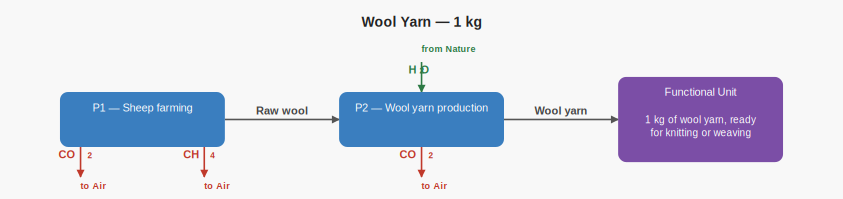
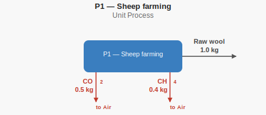
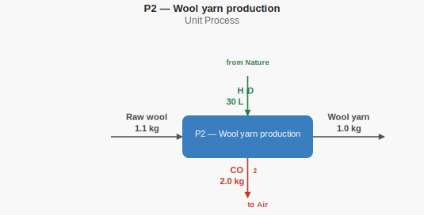
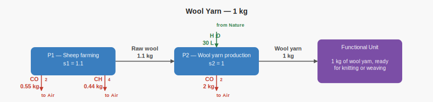

# Wool yarn hand calculations

This case represents the production of 1 kg of wool yarn. These calculations
are the independent ground truth recorded in `expected.json` and checked against
Brightway.

## Supply-chain structure



## Unit-process Diagrams (unscaled)

### P1 — Sheep farming



### P2 — Wool yarn production



## Scaled supply-chain diagram



## Process scaling

Wool yarn production runs once and consumes 1.1 kg of raw wool per kg of yarn:

```text
s_yarn  = s_2 = 1.0
s_sheep = s_1 = s_2 × 1.1 = 1.1
```

## Inventory totals

```text
CO2   = (1.1 × 0.5) + (1.0 × 2.0) = 2.55 kg
CH4   = 1.1 × 0.4                 = 0.44 kg
Water = 1.0 × 30                  = 30 L
```

## LCIA results

The characterization factors match the TRACI v2.1 factors used by the
corresponding LCA MCP teaching case.

```text
GWP = (2.55 × 1) + (0.44 × 25) = 13.55 kg CO2-eq
MIR = 0.44 × 0.014379488       = 0.00632697472 kg O3-eq
```
